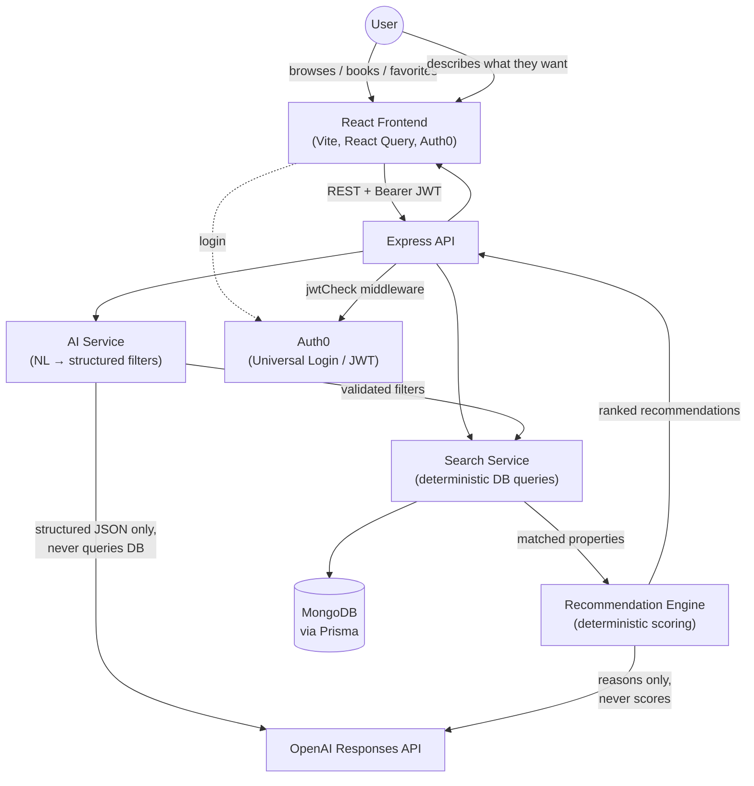

# Homyz — AI-Powered Real Estate Platform

Homyz is a full-stack real estate marketplace: property listings, booking, favorites, map-based location previews, and a conversational **AI Property Search** with a deterministic **AI Recommendation Engine** layered on top of a purpose-built backend search service.

> 📖 Deeper documentation lives in [`docs/`](docs/): [Architecture](docs/architecture.md) · [API Reference](docs/api.md) · [AI System](docs/ai.md) · [Agentic AI Advisor](docs/agent.md) · [Deployment](docs/deployment.md)

---

## Table of Contents

- [Project Overview](#project-overview)
- [Features](#features)
- [Screenshots](#screenshots)
- [Technology Stack](#technology-stack)
- [Architecture Diagram](#architecture-diagram)
- [AI Features](#ai-features)
- [Installation](#installation)
- [Environment Variables](#environment-variables)
- [Running the Frontend](#running-the-frontend)
- [Running the Backend](#running-the-backend)
- [Folder Structure](#folder-structure)
- [API Overview](#api-overview)
- [Future Roadmap](#future-roadmap)
- [Contributors](#contributors)
- [License](#license)

---

## Project Overview

Homyz lets users browse property listings, view rich property detail pages with an interactive map, book a viewing, save favorites, and — the flagship feature — **search for a property in plain English** ("3 bedroom apartment under 80 lakh in Kolkata") and get back a **ranked, explained** shortlist of matching listings instead of a raw, unordered list.

The AI layer is deliberately split into two independent, auditable stages:

1. A **Search Service** that performs conventional, deterministic database queries (Sprint 2A).
2. An **AI Search** layer that only *translates* natural language into the same structured filters the Search Service already understands (Sprint 2B/2C), followed by a **Recommendation Engine** that *deterministically* scores and ranks the results — the LLM is never allowed to decide which property wins (Sprint 3).

## Features

| Category | Capability |
|---|---|
| **Listings** | Property grid, rich detail page, image, price, facilities |
| **Search & Filters** | Keyword/city/country/price-range/bedroom/bathroom filtering via a dedicated backend Search Service (no client-side full-table filtering) |
| **AI Property Search** | Floating conversational assistant — describe what you want in plain English |
| **AI Recommendation Engine** | Every AI search result is scored 0–100% with human-readable, non-hallucinated reasons and an optional plain-English explanation |
| **Booking** | Book/cancel a property visit with a date picker |
| **Favorites** | Heart-toggle favorites, dedicated Favorites page |
| **Maps** | Per-property map preview (address geocoded on the fly) |
| **Authentication** | Auth0 (Universal Login), JWT-protected mutation endpoints |

## Screenshots

> Screenshots are not yet captured in this repository. Recommended shots to add here before publishing:

| Home Page | Property Listing | Property Detail |
|---|---|---|
| `docs/screenshots/home.png` | `docs/screenshots/listing.png` | `docs/screenshots/detail.png` |

| AI Search — Conversation | AI Search — Recommendation Card |
|---|---|
| `docs/screenshots/ai-search-chat.png` | `docs/screenshots/ai-recommendation.png` |

## Technology Stack

**Frontend**
- React 18 + Vite
- React Router 6
- React Query 3 (server-state caching)
- Axios
- Mantine UI (forms, modals, date picker)
- Framer Motion (AI Search modal animation)
- Leaflet + Esri Leaflet Geocoder (map preview)
- Auth0 React SDK

**Backend**
- Node.js + Express 4
- Prisma ORM → MongoDB
- Auth0 (`express-oauth2-jwt-bearer` JWT verification)
- OpenAI Node SDK (Responses API, Structured Outputs)
- Zod (schema validation)

**Data**
- MongoDB (via Prisma's `mongodb` connector, with native `aggregateRaw` used where Prisma's query builder can't reach into JSON fields)

## Architecture Diagram



See [docs/architecture.md](docs/architecture.md) for the full breakdown, including the authentication flow and database design.

## AI Features

Full details in [docs/ai.md](docs/ai.md). In short:

- **AI Property Search** (`POST /api/ai/search`) — a natural-language prompt is converted into structured filters (`city`, `country`, `minPrice`, `maxPrice`, `bedrooms`, `bathrooms`, `keyword`) using OpenAI's Responses API with **Structured Outputs**, validated with **Zod**, and retried once before failing cleanly. The model is explicitly forbidden from inventing properties or answering questions — it only extracts filters.
- **AI Recommendation Engine** — every matched property is scored **deterministically** (Budget 35 / Bedrooms 20 / Bathrooms 10 / City 15 / Amenities 20 = 100 points), never by the LLM. The LLM is only ever used, optionally, to rephrase an already-decided list of reasons into one friendly sentence — it cannot influence the score or the ranking order.
- **Conversational UI** — a floating assistant button opens a glassmorphism chat modal (Framer Motion), with suggested prompts, a typing indicator, and results rendered as ranked, expandable cards ("⭐ AI Match 94%" → "Why this recommendation?") using the same `PropertyCard` component as the rest of the app.

## Installation

**Prerequisites**
- Node.js 18+ and npm
- A MongoDB connection string (Atlas or self-hosted)
- An Auth0 tenant (SPA application)
- An OpenAI API key

```bash
git clone <repository-url>
cd homyz-main

# Backend
cd server
npm install

# Frontend
cd ../client
npm install
```

## Environment Variables

### Backend (`server/.env`)

| Variable | Required | Description |
|---|---|---|
| `PORT` | No (defaults to `3000`) | Port the Express server listens on. Local dev uses `8000`. |
| `DATABASE_URL` | **Yes** | MongoDB connection string consumed by Prisma. |
| `OPENAI_API_KEY` | **Yes**, for AI features | OpenAI API key. Read only from `process.env` — never hardcoded. Without it, `/api/ai/search` returns `503`. |
| `OPENAI_MODEL` | No (defaults to `gpt-4o-mini`) | Overrides the model used for both filter extraction and recommendation explanations. |

> **Note:** Auth0 configuration (`audience`, `issuerBaseURL`) is currently hardcoded in `server/config/auth0Config.js` rather than sourced from environment variables. See [Future Roadmap](#future-roadmap).

### Frontend

The client currently has **no `.env` file** — the API base URL, Auth0 `domain`/`clientId`/`audience`, and the Cloudinary upload preset are hardcoded in source (`client/src/utils/api.js` and `client/src/main.jsx`). This is a known limitation; see [docs/deployment.md](docs/deployment.md) for the recommended fix before deploying to a non-local environment.

## Running the Frontend

```bash
cd client
npm run dev       # Vite dev server, default http://localhost:5173
npm run build     # production build → client/dist
npm run preview   # preview the production build locally
```

## Running the Backend

```bash
cd server
npm run start     # nodemon index.js — auto-reloads on file changes
```

The API will be available at `http://localhost:8000/api` (per the current `PORT` value in `server/.env`).

Before first run, generate the Prisma client and confirm the DB connection:

```bash
cd server
npx prisma generate
```

## Folder Structure

```
homyz-main/
├── client/                        # React + Vite frontend
│   └── src/
│       ├── components/
│       │   ├── AiSearch/          # Floating AI Search button, modal, chat UI
│       │   ├── PropertyCard/      # Reused everywhere properties are listed
│       │   ├── Layout/            # App shell — mounts Header/Footer/AI Search
│       │   └── ...                # Booking, Favorites, Map, Add-Property wizard, etc.
│       ├── pages/                 # Websites (home), Properties, Bookings, Favourites
│       ├── hooks/                 # React Query hooks (useAiSearch, useSearchProperties, ...)
│       ├── context/                # UserDetailContext (favourites/bookings/token)
│       └── utils/                 # Axios instance + all API calls (api.js)
│
├── server/                        # Node.js + Express backend
│   ├── config/                    # Prisma client, Auth0 jwtCheck middleware
│   ├── routes/                    # residencyRoute, userRoute, aiRoutes
│   ├── controllers/               # resdCntrl, userCntrl, aiController
│   ├── services/
│   │   ├── searchService.js       # Deterministic property search (Sprint 2A)
│   │   ├── aiService.js           # NL → filters via OpenAI; reason → sentence
│   │   └── recommendationService.js # Deterministic scoring + ranking (Sprint 3)
│   ├── utils/
│   │   ├── aiPrompt.js             # System prompt for filter extraction
│   │   └── scoring.js              # Deterministic per-criterion scorers
│   ├── prisma/schema.prisma       # User, Residency models (MongoDB)
│   └── index.js                   # Express app entrypoint
│
└── docs/                          # This documentation set
```

## API Overview

Full request/response documentation, error codes, and examples: **[docs/api.md](docs/api.md)**.

| Area | Method | Endpoint | Auth |
|---|---|---|---|
| Property | `POST` | `/api/residency/create` | ✅ |
| Property | `GET` | `/api/residency/allresd` | — |
| Property | `GET` | `/api/residency/search` | — |
| Property | `GET` | `/api/residency/:id` | — |
| User | `POST` | `/api/user/register` | ✅ |
| User | `POST` | `/api/user/bookVisit/:id` | ✅ |
| User | `POST` | `/api/user/allBookings` | — |
| User | `POST` | `/api/user/removeBooking/:id` | ✅ |
| User | `POST` | `/api/user/toFav/:rid` | ✅ |
| User | `POST` | `/api/user/allFav` | ✅ |
| AI Search + Recommendations | `POST` | `/api/ai/search` | — |

## Future Roadmap

- Move Auth0 config and frontend API base URL to environment variables (`VITE_*`) for real multi-environment deployment.
- Typed `bedrooms`/`bathrooms`/`parking` columns (currently a loosely-typed `facilities` JSON blob with observed inconsistencies — some records store numbers as strings, and parking has been written under both `parking` and `parkings` keys).
- Store `lat`/`lng` at property-creation time instead of geocoding on every page view.
- Pagination on `GET /api/residency/allresd` and `/search`.
- Rate limiting on `/api/ai/search` (an LLM-backed endpoint has a materially different cost/abuse profile than a plain DB read).
- Semantic/vector search over property descriptions as a complementary retrieval layer (see [docs/ai.md](docs/ai.md) — Future Agentic AI Architecture).
- Automated tests and CI/CD (see [docs/deployment.md](docs/deployment.md)).

## Contributors

<!-- This repository has no commit history to attribute automatically (not yet a git repo at time of writing). Replace with your team: -->

| Name | Role |
|---|---|
| _Add your name_ | _Add your role_ |

## License

`server/package.json` declares `MIT`, but no top-level `LICENSE` file exists in this repository yet. Add one (MIT is a reasonable default for a project like this) before publishing or open-sourcing.
