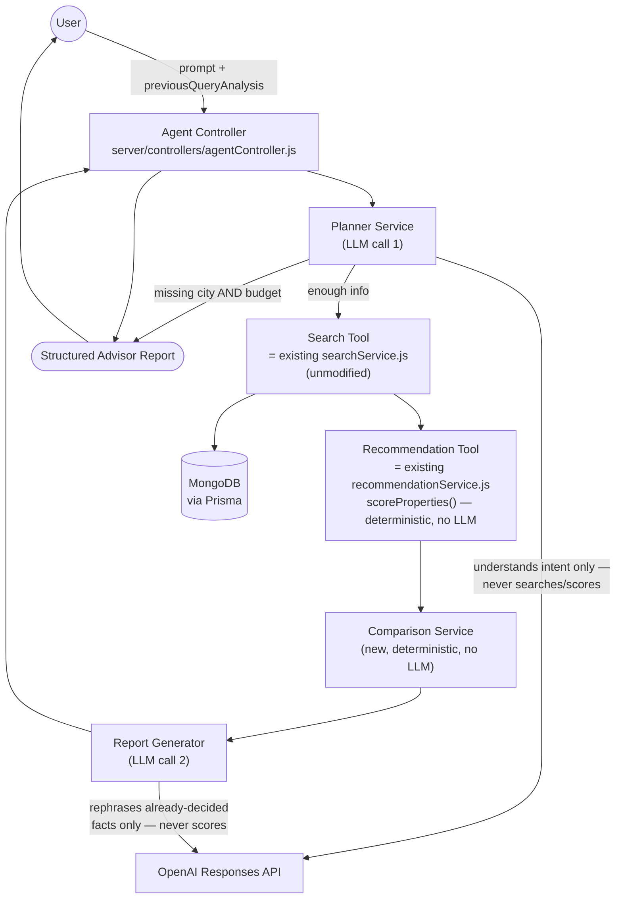
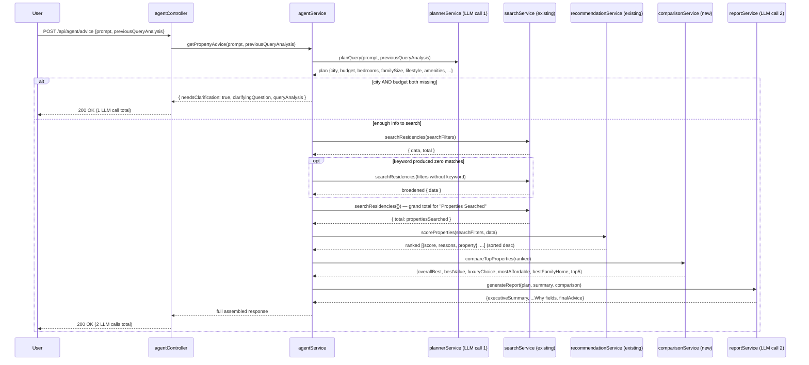

# Agentic AI Property Advisor (Sprint 4)

Sprint 4 transforms the AI Search Assistant (Sprints 2–3) into an **Agentic AI Property Advisor**: instead of returning a ranked list of matches, it plans the user's real goal, orchestrates the existing Search Service and Recommendation Engine plus two new deterministic services, and produces a full advisory report — Overall Best, Best Value, Luxury Choice, an expandable comparison, and final advice.

**Nothing from Sprints 2–3 was rewritten.** `POST /api/ai/search`, `searchService.searchResidencies`, and the Recommendation Engine's existing exported behavior (`rankProperties`) are byte-for-byte unchanged and regression-tested. The only backend "modifications" are two small, additive extractions (see [Design Notes](#design-notes-what-was-touched-and-why)) that expose already-existing logic for reuse — no behavior of any existing export changed.

---

## Table of Contents

- [Architecture Diagram](#architecture-diagram)
- [New Folder Structure](#new-folder-structure)
- [Execution Flow](#execution-flow)
- [Planner Logic](#planner-logic)
- [Tool Flow](#tool-flow)
- [API Documentation](#api-documentation)
- [Conversation Memory](#conversation-memory)
- [Cost Optimization](#cost-optimization)
- [Testing Checklist](#testing-checklist)
- [Future Improvements](#future-improvements)
- [Design Notes: What Was Touched, and Why](#design-notes-what-was-touched-and-why)

---

## Architecture Diagram



This matches the sprint's requested shape exactly: **User → Agent Controller → Planner → Tool Executor → Search Service → Recommendation Service → Comparison Service → Report Generator → Response**, with the "Tool Executor" role played by `agentService.js` (it decides *whether* to run the search/recommend/compare/report chain at all, based on the Planner's output, then calls each in order).

## New Folder Structure

```
server/
├── controllers/
│   └── agentController.js      Thin controller: validates input, calls agentService, returns JSON.
├── services/
│   ├── agentService.js          Orchestrator — the only file that calls all the others in sequence.
│   ├── plannerService.js        LLM call 1: intent extraction, clarifying-question decision.
│   ├── comparisonService.js     New, but 100% deterministic — no LLM, no database access.
│   ├── reportService.js         LLM call 2: narrative generation only.
│   ├── searchService.js         [Sprint 2A — unmodified] reused as the Search Tool.
│   ├── recommendationService.js [Sprint 3 — additive only] reused as the Recommendation Tool
│   │                            via its new `scoreProperties` export (see Design Notes).
│   └── aiService.js             [Sprint 2B — additive only] `getClient`/`MODEL`/`mapOpenAIError`
│                                 now exported so planner/report reuse the same OpenAI client setup
│                                 instead of duplicating it.
├── routes/
│   └── agentRoutes.js           POST /advice, mounted at /api/agent in server/index.js.
└── utils/
    └── agentPrompts.js          PLANNER_SYSTEM_PROMPT and REPORT_SYSTEM_PROMPT.

client/src/
├── hooks/
│   └── useAgentAdvisor.js       New hook: conversation state, calls /api/agent/advice, carries
│                                 `previousQueryAnalysis` forward for refinement (conversation memory).
├── utils/api.js                 [additive] getAgentAdvice() added alongside the existing calls.
└── components/AiSearch/
    ├── ChatMessage.jsx           [additive] new AdvisorReport + AdvisorPickCard sub-components;
    │                             the original RecommendationCard/rendering path is untouched and
    │                             still there, just no longer the active path (see Design Notes).
    ├── AiSearchModal.jsx         [one-line swap] now calls useAgentAdvisor instead of useAiSearch;
    │                             header/welcome copy updated to reflect the advisor. No CSS,
    │                             animation, focus-trap, or ESC-handling logic touched.
    └── AiSearch.css              [additive] new .ai-advisor-* rules; nothing existing removed/changed.
```

## Execution Flow



## Planner Logic

`plannerService.planQuery(prompt, previousPlan)` is the **only** step allowed to ask the user anything, and the only step that decides whether the pipeline proceeds at all.

1. **Extraction.** A single OpenAI Structured Outputs call (`openai.responses.parse`) extracts: `city`, `country`, `minPrice`/`maxPrice` (with lakh/crore shorthand expansion), `bedrooms`, `bathrooms`, `familySize`, `lifestyle[]` (Family/Investment/Luxury/Pet Friendly/Near Metro/Near IT Park/Retirement/Rental), `amenities[]`, `specialRequirements`, and `keyword`.
2. **Two-schema validation**, same pattern as `aiService.js`'s filter extraction: a permissive *wire* schema (nullable, no refinements — OpenAI's strict Structured Outputs mode doesn't enforce refinements) is what's handed to the model; a stricter *domain* schema (`.int()`, `.nonnegative()`, etc.) validates what actually comes back.
3. **Refinement, not restart.** If `previousPlan` is provided (the client's last `queryAnalysis`), it's serialized into the prompt with an explicit instruction: keep every previous field the new message doesn't contradict, only change what the new message actually addresses. This is what makes "now only pet friendly" add to the existing city/budget instead of discarding them.
4. **Missing-info check is deterministic, not model-trusted.** Regardless of what the model's own `missingCriticalInfo` boolean says, `plannerService.js` recomputes it from the final merged fields: `missing = !(city || minPrice != null || maxPrice != null)`. A model arithmetic slip on the boolean can't silently break the flow either way.
5. **One clarifying question, never more.** If critical info truly is missing, a single question is returned and the pipeline stops — no search, no recommendation, no comparison, no second LLM call.
6. **Never retried.** Unlike the existing filter-extraction endpoint (which retries once against a 422), the planner is deliberately not retried — a failure here (API error, invalid output) falls back to a hardcoded clarifying question at zero additional LLM cost, keeping the "never call the LLM more than twice" budget a hard ceiling rather than a soft target.

## Tool Flow

The sprint asked the Planner to "decide which tools are required." In practice, only one part of that decision is knowable *before* running anything: **is there enough information to search at all** (Planner's `missingCriticalInfo`). Whether *Comparison* is meaningful depends on how many results the Search Tool actually returns, which isn't knowable until after the Search Tool runs — so `agentService.js` combines the Planner's coarse go/no-go decision with runtime-deterministic tool selection:

| Tool | Reused from | Runs when |
|---|---|---|
| **Search Tool** | `searchService.searchResidencies` (Sprint 2A, unmodified) | Planner found at least a city or a budget |
| **Recommendation Tool** | `recommendationService.scoreProperties` (Sprint 3, new deterministic export) | Search Tool ran (always follows it) |
| **Comparison Tool** | `comparisonService.compareTopProperties` (new) | Recommendation Tool ran (always follows it; gracefully returns all-`null` on zero results) |
| **Report Tool** | `reportService.generateReport` (new) | Always runs *unless* there were zero matches, in which case it skips the LLM call entirely and returns a templated "no matches" narrative |

An additional **deterministic adaptive step** lives between Search and Recommendation: if a `keyword` filter produces zero matches (a real, tested failure mode — a single-term keyword like `"schools"` may not literally appear in any listing's text), the Search Tool is called a second time with the keyword dropped, keeping city/budget/bedrooms/bathrooms. This is tool-use adaptation, not a ranking decision, and costs zero LLM calls — it's plain retry logic in `agentService.js`.

## API Documentation

### `POST /api/agent/advice`

| | |
|---|---|
| **Auth** | — Public (same as `/api/ai/search`) |

**Request**

```json
{
  "prompt": "I am moving to Bangalore with my family of four. Budget is 1 crore. I need a safe home with parking and good schools nearby.",
  "previousQueryAnalysis": null
}
```

| Field | Type | Notes |
|---|---|---|
| `prompt` | string | Required, non-empty after trimming, ≤ 500 characters |
| `previousQueryAnalysis` | object \| null | Optional. Pass back the exact `queryAnalysis` object from the previous response in this chat session to refine instead of restart. Omit or `null` on the first turn. |

**Response — clarification needed** (search never ran; 1 LLM call)

```json
{
  "success": true,
  "needsClarification": true,
  "clarifyingQuestion": "I can help with that. Which city are you looking in, and what's your budget?",
  "queryAnalysis": { "city": null, "amenities": ["Pool"], "...": "..." }
}
```

**Response — full advisory report** (2 LLM calls)

```json
{
  "success": true,
  "needsClarification": false,
  "queryAnalysis": {
    "city": "Bangalore", "country": null,
    "budget": { "min": null, "max": 10000000 },
    "bedrooms": 3, "bathrooms": null, "familySize": 4,
    "lifestyle": ["Family"], "amenities": ["Parking"],
    "specialRequirements": "wants a safe neighborhood and good schools nearby",
    "keyword": "schools"
  },
  "summary": {
    "propertiesSearched": 67,
    "matchingProperties": 1,
    "searchFilters": { "city": "Bangalore", "maxPrice": 10000000, "bedrooms": 3 },
    "executiveSummary": "In your search for a family home in Bangalore, ..."
  },
  "bestProperty":  { "label": "Overall Best",  "score": 100, "reasons": ["..."], "why": "...", "property": { "...": "..." } },
  "bestValue":     { "label": "Best Value",    "score": 100, "reasons": ["..."], "why": "...", "property": { "...": "..." } },
  "luxuryChoice":  { "label": "Luxury Choice", "score": 100, "reasons": ["..."], "why": "...", "property": { "...": "..." } },
  "recommendations": [ { "score": 100, "reasons": ["..."], "property": { "...": "..." } } ],
  "comparison": {
    "mostAffordable": { "label": "Most Affordable", "...": "..." },
    "bestFamilyHome":  { "label": "Best Family Home", "...": "..." }
  },
  "finalAdvice": { "text": "...", "topPickPropertyId": "6a759abddd9642a83f6d92d0" }
}
```

Note that `summary.propertiesSearched` (total DB size, via a second unfiltered call to the same Search Tool) and `summary.matchingProperties` (this query's match count) are deliberately different numbers — matching the sprint's example report ("Properties Searched: 58 / Matching Properties: 12").

**Errors**

| Status | Body | Cause |
|---|---|---|
| `400` | `{ "success": false, "message": "'prompt' is required and must be a non-empty string." }` | Missing/empty/non-string prompt |
| `400` | `{ "success": false, "message": "'prompt' must be 500 characters or fewer." }` | Prompt too long |
| `400` | `{ "success": false, "message": "'previousQueryAnalysis', if provided, must be an object." }` | Malformed memory payload |

Unlike `/api/ai/search`, this endpoint does not surface 422/429/503/504 — every LLM-level failure (bad output, timeout, rate limit, missing key) is caught inside `plannerService`/`reportService` and degrades to a clarifying question or a templated narrative instead, so a `200` with `success: true` is the overwhelmingly common response shape even when something upstream went wrong.

## Conversation Memory

Memory is **entirely client-held**, matching the sprint's "resets when the chat session ends" requirement — nothing is stored server-side.

- `useAgentAdvisor.js` keeps a `useRef` holding the last response's `queryAnalysis`.
- Every `sendMessage` call sends that ref's current value as `previousQueryAnalysis`.
- After each response, the ref is updated to the *new* `queryAnalysis` — including after a clarifying-question turn, so a two-step "what city?" → "Bangalore" exchange also merges correctly.
- Because the ref lives inside the hook, and the hook is only mounted while `AiSearchModal` renders its content, memory is naturally scoped to one open chat session — closing and reopening the modal starts fresh (a brand new hook instance, per how `AiSearchModal.jsx` mounts it via `AnimatePresence`).

## Cost Optimization

**Hard ceiling: 2 LLM calls per request, enforced by code structure, not convention.**

- Call 1 — `plannerService.planQuery` (always exactly 0 or 1 call; never retried).
- Call 2 — `reportService.generateReport` (0 calls if there are no matches to report on; otherwise exactly 1 call; never retried).
- Search, Recommendation, and Comparison are 100% deterministic — `searchService.searchResidencies` (Prisma/MongoDB only), `recommendationService.scoreProperties` (pure scoring, the LLM-explanation half of `rankProperties` is deliberately *not* used here), and `comparisonService.compareTopProperties` (pure JS) never call OpenAI.
- The "drop keyword and retry" adaptive step is a second **Search Tool** call (a Prisma query), not a second LLM call.
- The "grand total" lookup for `propertiesSearched` is a third **Search Tool** call, also not an LLM call.

## Testing Checklist

All items below were run live against the real backend (and, where noted, the real browser) during development — not just written as a plan.

- [x] **Happy path** — exact sprint example prompt ("moving to Bangalore... family of four... 1 crore... safe home with parking and good schools") returns a full report with a real matched property, correct `queryAnalysis`, and grounded `why` text.
- [x] **Clarifying question** — a vague prompt with no city/budget ("I want a nice place with a pool") returns `needsClarification: true` with a single question, and does **not** run search/recommendation/comparison/report.
- [x] **Conversation memory / refinement** — turn 1 ("apartments in Mumbai under 70 lakh") then turn 2 ("now only pet friendly") with `previousQueryAnalysis` correctly retains city/budget from turn 1 while adding the new lifestyle tag, rather than resetting.
- [x] **Adaptive keyword-drop fallback** — a keyword that matches nothing (`"schools"`) is dropped and the search re-run on structural filters alone, turning a false zero-result response into real matches.
- [x] **Multi-result comparison correctness** — with 4 real matches, `bestValue`/`luxuryChoice`/`mostAffordable`/`bestFamilyHome` resolve to genuinely different properties (verified: cheapest ≠ most expensive ≠ most bedrooms), not degenerate duplicates.
- [x] **Zero-match honesty** — comparison/report gracefully report "no properties matched" rather than fabricating a pick, when a search legitimately returns nothing.
- [x] **Regression: `/api/ai/search` unchanged** — identical request/response behavior before and after the `recommendationService.js`/`aiService.js` additive refactors.
- [x] **Regression: existing Properties page SearchBar** — still filters via the Sprint 2A backend search exactly as before (67 → 12 results typing "villa").
- [x] **Regression: PropertyCard navigation** — clicking a result inside the new Advisor Report navigates to the correct `/properties/:id`, same as the original AI Search cards.
- [x] **Frontend build** — `vite build` succeeds; live browser test shows zero console errors across open modal → send prompt → view report → expand comparison → expand "why" reasons.
- [ ] *(Not yet automated — recommended before merging to a shared branch)* a scripted integration test asserting the LLM call count for a single `/api/agent/advice` request never exceeds 2 (e.g. by mocking the OpenAI client and counting invocations).
- [ ] Load/concurrency testing — the "grand total" lookup adds one extra DB query per request; worth confirming this doesn't measurably regress latency under load once indexes are added (see `docs/architecture.md`'s Scalability Considerations, still outstanding from Sprint 2).

## Future Improvements

- **True tool-calling.** Currently the Planner outputs a structured plan and `agentService.js` executes a fixed pipeline. A more agentic version could expose Search/Recommendation/Comparison as OpenAI *tools* the model calls directly and iteratively (e.g. searching once, seeing few results, then deciding on its own to broaden), rather than the single fixed adaptive retry implemented here.
- **Currency-parsing verification step.** Live testing surfaced one run where "1 crore" was misconverted to 10 crore by the model (a genuine LLM arithmetic slip, not a prompt-design gap — the prompt's examples were already unambiguous). A cheap deterministic sanity pass (e.g., flag budgets that are implausibly large relative to stated units) could catch this without adding an LLM call.
- **Persist conversation memory server-side (optional, opt-in)** for logged-in users, so a session survives a page reload — currently and intentionally client-only/session-scoped per the sprint's explicit requirement.
- **Feed amenities/lifestyle into scoring** more richly once `facilities` moves to a typed schema (see `docs/architecture.md`) — today, amenity/lifestyle intent mostly informs the report's narrative and the `keyword` search term, since the Recommendation Engine's scoring buckets are fixed at 5 criteria by Sprint 3 design ("do not modify scoring").
- **Rate limiting on `/api/agent/advice`** specifically — it's cheaper per-request than the old endpoint in the worst case (same ≤2-call ceiling) but is still LLM-backed and public; see `docs/deployment.md`'s existing recommendation for `/api/ai/*`, which should be extended to `/api/agent/*`.

## Design Notes: What Was Touched, and Why

Two additive changes were made to Sprint 2/3 files, both verified to leave existing behavior 100% unchanged:

1. **`recommendationService.js`** — the scoring+sorting logic that was inlined inside `rankProperties` was extracted into a new exported function, `scoreProperties(filters, properties)`, with zero logic changes. `rankProperties` now simply calls `scoreProperties` internally and continues exactly as before (LLM explanations for the top 5, deterministic fallback sentence otherwise). This was necessary because `rankProperties` itself makes up to 5 LLM calls (for per-property explanations) — reusing it as-is inside the agent would have blown well past the "never call the LLM more than twice" budget. The Agent's Recommendation Tool calls `scoreProperties` directly, which has zero LLM calls, while `/api/ai/search` continues to call `rankProperties` exactly as it always has.
2. **`aiService.js`** — `getClient`, `MODEL`, and `mapOpenAIError` were already module-private; they were given the `export` keyword (no implementation changes) so `plannerService.js`/`reportService.js` reuse the exact same OpenAI client/timeout/model/error-mapping setup instead of duplicating it in a third and fourth place.

On the frontend, `AiSearchModal.jsx` now calls `useAgentAdvisor` instead of `useAiSearch`, and its header/welcome copy were updated to reflect the advisor — this is the one integration point that had to change for "the existing AI Chat Modal" to actually *become* the advisor, per the sprint's stated objective. `useAiSearch.js` and the original recommendation-list rendering branch inside `ChatMessage.jsx` were left fully intact (not deleted), just no longer the active code path from the modal.
