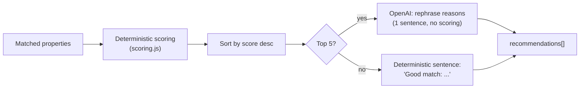
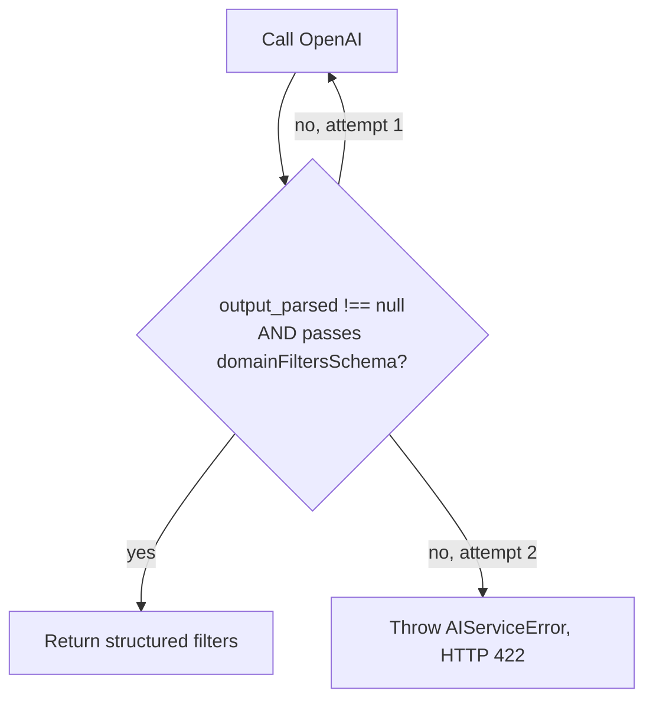

# AI System

Homyz has two independent AI touchpoints, and the boundary between them is the single most important architectural rule in this codebase:

1. **Natural Language Search** (`server/services/aiService.js` → `extractSearchFilters`) — converts a prompt into structured filters. **Never queries the database.**
2. **Recommendation Engine** (`server/services/recommendationService.js` + `server/utils/scoring.js`) — scores and ranks already-fetched results **deterministically**, and optionally asks the LLM to rephrase (never decide) the reasons. **The LLM never ranks anything.**

This document explains how each works, why they're built this way, and what a more advanced ("agentic") version could look like later.

---

## Table of Contents

- [Natural Language Search](#natural-language-search)
- [Structured Output](#structured-output)
- [OpenAI Responses API](#openai-responses-api)
- [Prompt Design](#prompt-design)
- [Zod Validation](#zod-validation)
- [Recommendation Engine](#recommendation-engine)
- [Scoring Algorithm](#scoring-algorithm)
- [Why Deterministic Scoring Is Used](#why-deterministic-scoring-is-used)
- [Why the LLM Never Ranks Properties](#why-the-llm-never-ranks-properties)
- [Retry Strategy](#retry-strategy)
- [Fallback Strategy](#fallback-strategy)
- [Cost Optimization](#cost-optimization)
- [Future Agentic AI Architecture](#future-agentic-ai-architecture)

---

## Natural Language Search

A user types something like:

> "Need a 3 bedroom apartment under 80 lakh in Kolkata"

`aiController.js` hands this string, untouched, to `aiService.extractSearchFilters(prompt)`, which returns a plain object:

```json
{ "city": "Kolkata", "maxPrice": 8000000, "bedrooms": 3, "keyword": "apartment" }
```

That object is then passed — **unmodified** — into `searchService.searchResidencies(filters)`, the exact same function `GET /api/residency/search` uses. `aiService.js` has no import of Prisma, no import of the search service, and no code path that reaches MongoDB. This isn't just a convention; it's enforced by the module's own dependency graph.

## Structured Output

The extraction step uses OpenAI's **Structured Outputs** feature (strict JSON schema mode) via the Responses API, so the model is constrained at the token-generation level to return exactly the shape we ask for — not just "usually returns JSON we can parse," but decoding-level guarantees.

A subtlety discovered while building this: **OpenAI's strict Structured Outputs mode does not enforce numeric/string refinements** like `minimum`, `maximum`, `minLength` — some are silently ignored, and including certain unsupported keywords can make the API reject the schema outright. Since the natural approach (`z.number().int().nonnegative()`) uses exactly these refinements, a single schema couldn't safely do both jobs — "tell OpenAI the shape" and "actually enforce the constraints." That's why there are two schemas (see [Zod Validation](#zod-validation)).

## OpenAI Responses API

```js
const response = await openai.responses.parse({
  model: MODEL, // process.env.OPENAI_MODEL || "gpt-4o-mini"
  input: [
    { role: "system", content: AI_SYSTEM_PROMPT },
    { role: "user", content: prompt },
  ],
  text: { format: zodTextFormat(wireFiltersSchema, "search_filters") },
});
return response.output_parsed; // already parsed against wireFiltersSchema, or null on refusal
```

- `openai.responses.parse()` (not the lower-level `.create()`) automatically parses `response.output_text` against the Zod schema and exposes it as `output_parsed` — `null` if the model produced a refusal or unparseable content, which the code treats as "invalid output" and feeds into the retry loop.
- The model is configurable via `OPENAI_MODEL` (default `gpt-4o-mini`) so it can be swapped without a code change.
- The client is configured with a **20-second timeout** and **`maxRetries: 1`** at the SDK level (for transport-level retries like transient 5xxs) — separate from and in addition to the application-level "invalid output" retry described below.

The Recommendation Engine's explanation step (see below) uses the same client via the plain `openai.responses.create()` call (no structured format) and reads `response.output_text` directly, since it only needs free text.

## Prompt Design

The system prompt (`server/utils/aiPrompt.js`) is deliberately narrow and repeats its constraints in several forms, because a single "please only do X" instruction is easy for a model to drift from over a long enough system prompt otherwise:

```text
You are a search filter extraction engine for a real estate platform.

Strict rules:
- You are a filter extraction engine, not a real estate agent, chatbot, or assistant.
- Never recommend, describe, list, or invent properties. You have no access to any property data.
- Never answer questions, greet the user, or make conversation.
- Never explain your reasoning or add commentary of any kind.
- Never hallucinate a value that is not present or clearly implied in the prompt.
- Output ONLY the structured JSON object defined by the response schema...
- If the prompt contains no extractable filters at all, return an object where every field is null. Never refuse to respond.
```

It also gives explicit field-by-field extraction rules, including currency shorthand normalization ("80 lakh" → `8000000`, "1.2 crore" → `12000000`, "500k" → `500000`, "2 million" → `2000000`) — verified live: a prompt of *"3 bedroom house under 80 lakh in Kolkata"* correctly produces `"maxPrice": 8000000`.

A second, much smaller prompt (`RECOMMENDATION_EXPLANATION_PROMPT` in `aiService.js`) governs the Recommendation Engine's explanation step and is even more restrictive — see [Why the LLM Never Ranks Properties](#why-the-llm-never-ranks-properties).

## Zod Validation

Two schemas, doing two different jobs:

```js
// 1. Fed to OpenAI — structural only, no refinements, every field nullable.
//    This is what OpenAI's strict Structured Outputs mode can actually enforce.
const wireFiltersSchema = z.object({
  city: z.string().nullable(),
  country: z.string().nullable(),
  minPrice: z.number().nullable(),
  maxPrice: z.number().nullable(),
  bedrooms: z.number().nullable(),
  bathrooms: z.number().nullable(),
  keyword: z.string().nullable(),
});

// 2. Applied to whatever the model actually returned — the real contract.
const domainFiltersSchema = z.object({
  city: z.string().trim().min(1).nullable(),
  country: z.string().trim().min(1).nullable(),
  minPrice: z.number().nonnegative().nullable(),
  maxPrice: z.number().nonnegative().nullable(),
  bedrooms: z.number().int().nonnegative().nullable(),
  bathrooms: z.number().int().nonnegative().nullable(),
  keyword: z.string().trim().min(1).nullable(),
}).refine(
  (v) => v.minPrice === null || v.maxPrice === null || v.minPrice <= v.maxPrice,
  { message: "minPrice must not be greater than maxPrice" }
);
```

Only output that passes `domainFiltersSchema` is ever converted into search filters (nulls stripped to "absent" via `toSearchFilters`) and handed to the Search Service.

## Recommendation Engine

Once the Search Service returns matched properties, `recommendationService.rankProperties(filters, properties)`:

1. Scores every property against 5 weighted, deterministic criteria (`server/utils/scoring.js`).
2. Sorts descending by score.
3. Optionally asks the LLM to turn each property's already-decided `reasons` array into one friendly sentence.



## Scoring Algorithm

```js
export const WEIGHTS = { budget: 35, bedrooms: 20, bathrooms: 10, city: 15, amenities: 20 };
```

Each of the 5 scorer functions (`scoreBudget`, `scoreBedrooms`, `scoreBathrooms`, `scoreCity`, `scoreAmenities`) returns `{ applicable, matched, weight, reasons }`:

- **`applicable`** — could this criterion even be evaluated? (The user specified the relevant filter, *and* the property has the relevant data.) If not applicable, it's excluded from both the numerator and denominator.
- **`matched`** — does the property actually satisfy it?
- **`reasons`** — human-readable strings, added *only* when `matched` is true, built directly from the real filter/property values (e.g. `` `Matches your search for "${filters.keyword}"` `` — never a templated claim the data doesn't support).

**Final score**:

```js
const score = applicableWeight > 0
  ? Math.round((earnedWeight / applicableWeight) * 100)
  : 100; // nothing was applicable — nothing to disqualify anyone on, so it's a tie
```

This normalization matters: a search that only specifies `city` and `maxPrice` (30 of the possible 100 points' worth of criteria) can still reach 100% if both match — the score reflects "how well did this satisfy everything you actually asked for," not "how many of five fixed boxes did it check."

**"Keyword Match" and "Amenities Match" share one weighted bucket.** The `Residency` schema has no dedicated amenities field beyond `facilities.parking` (also seen as `facilities.parkings` — a real, pre-existing data inconsistency, not a typo), and free-text keyword matching is the only other amenity-like signal the data supports. Both checks run independently inside `scoreAmenities` and can each contribute a distinct reason string (e.g. both `Matches your search for "pool"` *and* `Parking available` can appear together), but the 20-point weight is only ever awarded once.

**Type/key inconsistencies handled defensively**: `facilities.bedrooms`/`bathrooms` are stored as both strings (`"4"`) and numbers (`4`) across real records — scoring compares via `Number(...)` on both sides rather than assuming a type. Parking is checked under both `facilities.parking` and `facilities.parkings`. One legacy record was found with an entirely different shape (`{beds: 3}`) — the scorer correctly reports `applicable: false` for it rather than crashing or guessing.

## Why Deterministic Scoring Is Used

- **Reproducibility**: the same property, the same filters, always produces the same score. An LLM asked "rank these" can (and does) vary run to run, even at low temperature.
- **Auditability**: every point on the scorecard traces to a specific field comparison you can log, test, and explain. "The LLM decided" is not an acceptable answer when a user asks "why is this ranked #1?"
- **Cost and latency**: scoring N properties deterministically is O(N) in-process; scoring N properties via N (or even 1 large) LLM calls is materially slower and non-free.
- **No hallucination risk in the ranking itself**: since scores never touch the LLM, there's no path for a fabricated "matches" claim to end up as a `reasons` entry — every reason is generated from a real comparison, and the LLM downstream can only rephrase reasons that already passed that bar.

## Why the LLM Never Ranks Properties

The Recommendation Engine's explanation prompt is explicit about this boundary:

```text
You write one short, friendly sentence explaining why a property matched a buyer's search.
You will receive a JSON array of short reason strings that have ALREADY been determined to be true —
you are not deciding what matches, only rephrasing.

Rules:
- Use only the reasons provided. Never add, invent, or imply any claim not present in the list.
- Never mention a score, ranking, or percentage.
- Write exactly one sentence, friendly and natural, no markdown, no bullet points, no preamble.
```

The function `explainRecommendationReasons(reasons)` receives **only an array of strings** — never the property object, never the filters, never a price. There is no code path by which this function could influence `score` or sort order even if the model tried; the score is computed and the array is already sorted before this function is ever called.

## Retry Strategy

**Filter extraction** (`extractSearchFilters`): up to 2 attempts.



Only *content* validity triggers this retry loop. Transport/provider failures (timeout, rate limit, auth) are mapped immediately to their own HTTP status and never consume a retry — a rate limit isn't going to resolve itself by asking again half a second later.

## Fallback Strategy

Two independent fallback layers, both designed so a partial AI failure never breaks the whole request:

1. **Missing/failing `OPENAI_API_KEY`** → `extractSearchFilters` throws a typed `AIServiceError(503)` immediately; `/api/ai/search` returns a clean `503` rather than crashing.
2. **Explanation generation failure** (`explainRecommendationReasons`) → the function catches everything internally and returns `null`; `recommendationService.js` falls back to a deterministic sentence (`` `Good match: ${reasons.join(", ")}.` ``) built from the exact same reasons the LLM would have rephrased. **Every recommendation always has an `explanation` — the LLM being unavailable degrades quality, not availability.**

## Cost Optimization

- **Explanation calls capped at the top 5 ranked results** (`MAX_LLM_EXPLANATIONS = 5` in `recommendationService.js`) — a search returning 27 properties still only ever makes 5 explanation calls, not 27.
- **Structured Outputs in one call** — filter extraction is a single request per search, not a multi-turn back-and-forth.
- **Wire schema kept minimal** (7 nullable fields, no descriptions/refinements) to keep the schema — and therefore the token overhead of the request — small.
- **`maxRetries: 1`** at the SDK level avoids compounding retries (SDK-level transport retry × application-level content retry) into unbounded latency/cost on a bad day.
- **Explanations run in parallel** (`Promise.all`), not sequentially, so the 5-call cap also bounds *latency*, not just spend.

## Future Agentic AI Architecture

The current system is intentionally a single-shot pipeline: one prompt → one set of filters → one search → one ranked list. A more agentic version could layer on top of the same deterministic core without weakening it:

- **Multi-turn refinement**: let the assistant ask a clarifying follow-up ("Did you mean Kolkata city or Kolkata district?") using the existing conversation history already held in `useAiSearch.js`, rather than requiring one perfect prompt.
- **Tool-calling instead of single-shot extraction**: expose `searchResidencies` itself as a callable tool to the model (OpenAI function/tool calling), letting the model issue multiple narrower searches in a conversation rather than one filter set per turn — while keeping the same rule that the *tool*, not the model, executes the query and the Recommendation Engine still scores the results deterministically afterward.
- **Semantic/vector retrieval as a complementary signal**: embed property descriptions and add a "semantic similarity" scorer alongside the existing deterministic criteria in `scoring.js` — additive to the weighted rubric, not a replacement for it, so ranking stays auditable.
- **Personalization**: incorporate a user's past favorites/bookings as an additional deterministic scoring criterion (e.g. "properties in cities you've favorited before") — still no LLM involvement in the scoring itself.
- **Streaming responses**: stream the filter-extraction and explanation steps to the chat UI incrementally rather than waiting for the full round trip, improving perceived latency without changing the underlying guarantees.

Whatever agentic capability gets added, the rule that has held throughout this build should hold going forward too: **the LLM proposes, the deterministic engine decides.**
