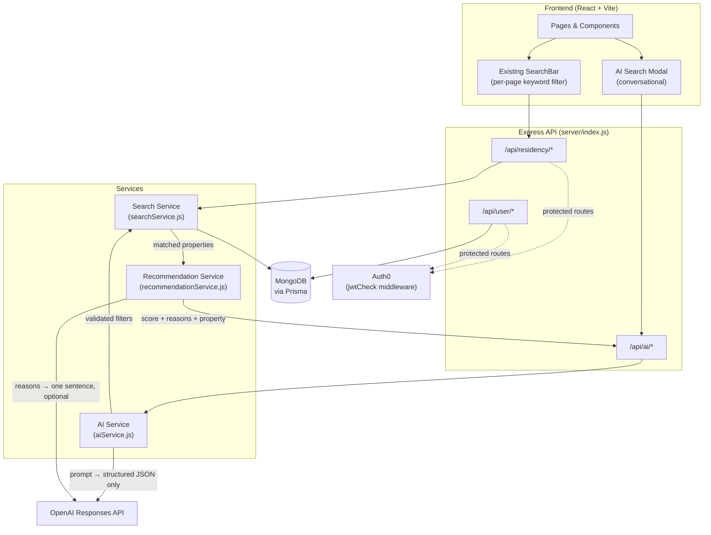
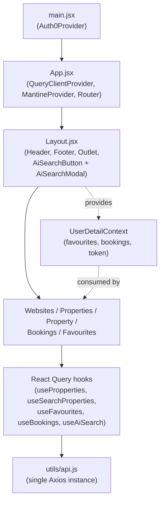
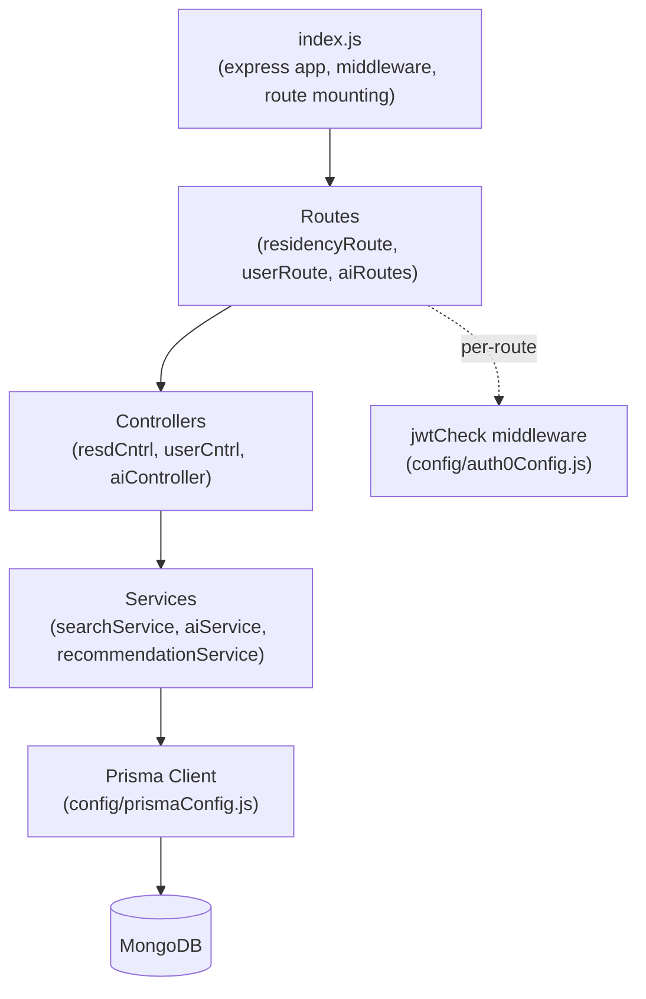
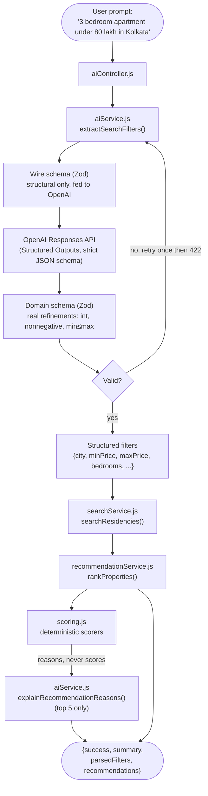
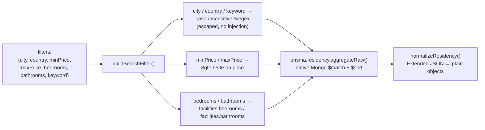
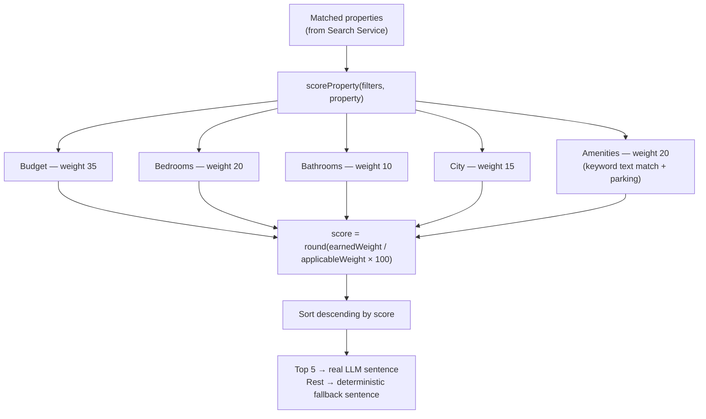
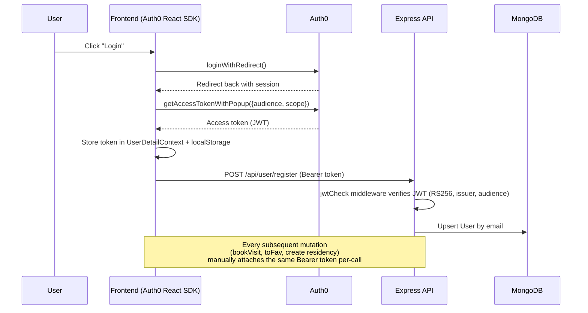
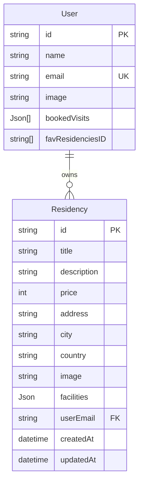

# Architecture

This document describes how Homyz is put together: the overall system, the frontend, the backend, the AI and search subsystems, the recommendation engine, authentication, database design, and the tradeoffs behind each decision.

---

## Table of Contents

- [Overall System Architecture](#overall-system-architecture)
- [Frontend Architecture](#frontend-architecture)
- [Backend Architecture](#backend-architecture)
- [AI Architecture](#ai-architecture)
- [Search Architecture](#search-architecture)
- [Recommendation Engine](#recommendation-engine)
- [Authentication Flow](#authentication-flow)
- [Database Design](#database-design)
- [Folder Structure](#folder-structure)
- [Design Decisions](#design-decisions)
- [Tradeoffs](#tradeoffs)
- [Scalability Considerations](#scalability-considerations)
- [Future Improvements](#future-improvements)

---

## Overall System Architecture

Homyz is a conventional three-tier app (React SPA → Express API → MongoDB) with one deliberate architectural rule layered on top: **the AI never talks to the database, and never decides ranking**. Two independent pipelines converge at the Search Service:



Two things to notice:

1. **`AIService` and `SearchService` are fully decoupled.** `AIService` exports a pure function, `extractSearchFilters(prompt) → filters`, with no knowledge of Prisma or MongoDB. `SearchService` exports `searchResidencies(filters) → { data, total }`, with no knowledge of OpenAI. The controller (`aiController.js`) is the only thing that wires them together — one calls the other, but neither imports the other's internals.
2. **The Recommendation Service sits *after* the Search Service, not inside it.** It receives already-filtered results and only re-orders/annotates them. It cannot expand, narrow, or re-query the result set.

## Frontend Architecture



- **Routing**: React Router 6, classic `<Routes>/<Route>` JSX (no data-router loaders). All routes are nested under a single pathless `Layout` route so `Header`/`Footer`/the floating AI Search button render on every page.
- **State management**: no Redux/Zustand. One plain `React.createContext` (`UserDetailContext`) holds `{ favourites, bookings, token }`, set via `useState` in `App.jsx`. All server data is cached with **React Query v3** — each feature owns a small hook (`usePropperties`, `useSearchProperties`, `useFavourites`, `useBookings`, `useAiSearch`) rather than a global store.
- **AI Search UI** (`components/AiSearch/`) is mounted once in `Layout.jsx`, so its conversation state (`useAiSearch`) survives navigation between pages for the lifetime of the SPA session. It reuses the existing `PropertyCard` component unmodified — the Recommendation Engine's score badge and expandable explanation are wrapped *around* it, not inside it.
- **Maps**: Leaflet + `esri-leaflet-geocoder`, **not** Google Maps. Each property's address is geocoded client-side on render; no coordinates are persisted.

## Backend Architecture



- **Express 4**, ESM (`"type": "module"`). Middleware: `express.json()`, `cookie-parser`, `cors()` (no origin restriction — see [Tradeoffs](#tradeoffs)).
- **No global error-handling middleware.** Controllers use `express-async-handler` to forward thrown errors to Express's default handler; the AI controller additionally catches its own typed `AIServiceError` explicitly to return meaningful status codes.
- **Auth is per-route, not global.** `jwtCheck` (an `express-oauth2-jwt-bearer` instance) is applied only to routes that mutate user- or owner-scoped data (`create`, `bookVisit`, `toFav`, etc.). Read endpoints (`allresd`, `search`, `:id`) and the AI search endpoint are intentionally public.
- **Prisma is the only ORM actually used at runtime.** `mongoose` is present in `package.json` but unused (no import anywhere in `server/`) — likely a leftover dependency.

## AI Architecture



Key properties of this pipeline:

- **The AI never queries MongoDB.** `aiService.js` has zero imports of Prisma or any database client.
- **Two Zod schemas, deliberately.** OpenAI's strict Structured Outputs mode does not enforce numeric/string refinements (`minimum`, `minLength`, etc.) — some are silently ignored, others can make the API reject the schema outright. So the schema hand to OpenAI (`wireFiltersSchema`) is deliberately permissive (every field nullable, no refinements), and a second, stricter `domainFiltersSchema` (with `.int()`, `.nonnegative()`, a `minPrice ≤ maxPrice` cross-field `.refine()`) is applied to whatever the model actually returns. This is what makes the retry-then-422 flow meaningful rather than decorative.
- **The Recommendation Engine is a second, independent AI touchpoint** that only ever receives a list of already-decided reason strings (e.g. `["Within your budget", "Parking available"]`) — never prices, filters, or property data — and is only asked to rephrase them into one sentence. See [Recommendation Engine](#recommendation-engine) and [docs/ai.md](ai.md) for why this boundary is enforced so strictly.

## Search Architecture

`GET /api/residency/search` and `POST /api/ai/search` both terminate in the same `searchService.js` — there is exactly one place property-filtering logic lives.

Supported filters: `city`, `country`, `minPrice`, `maxPrice`, `bedrooms`, `bathrooms`, `keyword`.



Why `aggregateRaw` instead of Prisma's `where`: **Prisma's MongoDB connector does not support JSON path filtering** (confirmed against Prisma's own issue tracker while building this) — and `facilities` is a `Json` column, not a typed field. So `bedrooms`/`bathrooms` filters are executed as a native MongoDB `$match` via `prisma.residency.aggregateRaw()`, which still filters entirely at the database level (no full-collection fetch into application memory), then the raw MongoDB Extended JSON documents (`{"$oid": ...}`, `{"$date": ...}`) are normalized back into the same shape `getAllResidencies`/`getResidency` already return.

A real data-quality issue surfaced while implementing this: **`facilities.bedrooms`/`bathrooms` are stored inconsistently as both strings (`"4"`) and numbers (`4`)** across existing records, and `facilities.parking` appears under two different keys (`parking` on older seed data, `parkings` on records created through the app's own "Add Property" wizard). Both the search filter and the recommendation scorer explicitly account for this (matching `$in: [String(v), v]`, and checking both parking key names) rather than assuming a clean schema.

## Recommendation Engine

Introduced in Sprint 3, purely as a post-processing stage after the Search Service — it never re-queries the database.



**Weights** (`server/utils/scoring.js`):

| Criterion | Weight | Data source |
|---|---|---|
| Budget Match | 35 | `filters.minPrice`/`maxPrice` vs `property.price` |
| Bedroom Match | 20 | `filters.bedrooms` vs `property.facilities.bedrooms` |
| Bathroom Match | 10 | `filters.bathrooms` vs `property.facilities.bathrooms` |
| City Match | 15 | `filters.city` vs `property.city` |
| Amenities Match | 20 | Keyword found in title/description/address, **and/or** `facilities.parking`/`parkings` present |
| **Total** | **100** | |

`Keyword Match` and `Amenities Match` deliberately share one weighted bucket: the schema has no dedicated "amenities" field beyond parking, so free-text keyword matching is the only other amenity-like signal available. Both checks still run independently and can each contribute their own reason string.

**Normalization**: a criterion only counts toward the denominator if it was *applicable* (the user specified that filter, and the property has the relevant data). This means a search that only specifies two of the five criteria can still reach 100% — the percentage reflects "how well does this match everything you actually asked for," not "how many of five arbitrary boxes did it tick."

**Explanation cost control**: only the top 5 ranked results get a real OpenAI call; the rest (and any result where the call fails) get a deterministic `"Good match: <reasons joined>."` sentence — every result always has *an* explanation, but token spend scales with a constant, not with result-set size.

## Authentication Flow



- Auth0 Universal Login on the frontend (`@auth0/auth0-react`); the backend never sees a password, only a verified JWT.
- `express-oauth2-jwt-bearer` (`server/config/auth0Config.js`) verifies signature (RS256), issuer, and audience — applied per-route via `jwtCheck`, not globally.
- There is **no centralized Axios interceptor** — each authenticated call in `client/src/utils/api.js` receives the token as an explicit argument and sets the `Authorization` header per-call. `Layout.jsx` is the single place the token is fetched and cached.
- `POST /api/user/allBookings` is a known exception: it is **not** protected by `jwtCheck` and instead trusts a client-supplied `email` in the request body. This is a pre-existing gap, documented in [docs/api.md](api.md) and flagged again in [Tradeoffs](#tradeoffs).

## Database Design



Two Prisma models, both stored in MongoDB:

- **`User.bookedVisits`** — `Json[]`, an array of `{id, date}` objects rather than a relation. Cancelling a booking is a read-modify-write (`findIndex`/`splice`, then rewrite the whole array) — not atomic, so concurrent cancellations from the same user are a (currently unlikely, low-traffic) race condition.
- **`User.favResidenciesID`** — `String[] @db.ObjectId`, raw IDs rather than a relation, so there's no referential integrity/cascade at the database level.
- **`Residency.facilities`** — untyped `Json`, holding `{bedrooms, bathrooms, parking|parkings}`. As covered above, real data is inconsistent in both value type (string vs number) and key name (`parking` vs `parkings`); the Search Service and Recommendation Engine both defensively handle this rather than assuming a clean schema.
- **No geo field.** Property coordinates are never stored — the frontend geocodes `address + city + country` live, on every render, via Esri's public geocoding service.
- `@@unique(fields: [address, userEmail])` is the only compound constraint; there is no index tuned for the search filters (`city`, `price`, `facilities.*`) — see [Scalability Considerations](#scalability-considerations).

## Folder Structure

```
homyz-main/
├── client/
│   ├── src/
│   │   ├── components/
│   │   │   ├── AiSearch/          AiSearchButton, AiSearchModal, ChatMessage,
│   │   │   │                      SuggestionChips, TypingIndicator, AiSearch.css
│   │   │   ├── PropertyCard/      Reused by the listing grid AND the AI Search results
│   │   │   ├── Layout/            Mounts Header, Footer, Outlet, AI Search
│   │   │   ├── SearchBar/         Existing per-page keyword filter (untouched by AI work)
│   │   │   ├── BookingModal/, Heart/, Map/, GeoCoderMarker/, ProfileMenu/
│   │   │   └── AddLocation/, UploadImage/, BasicDetails/, Facilities/, AddPropertyModal/
│   │   ├── pages/                 Websites (home), Properties (+ property/Property),
│   │   │                          Bookings, Favourites
│   │   ├── hooks/                 usePropperties, useSearchProperties, useFavourites,
│   │   │                          useBookings, useAuthCheck, useAiSearch, useDebouncedValue
│   │   ├── context/                UserDetailContext.js
│   │   └── utils/                  api.js (Axios + all backend calls), common.js
│   └── vite.config.js, vercel.json
│
├── server/
│   ├── config/                    prismaConfig.js, auth0Config.js
│   ├── routes/                    residencyRoute.js, userRoute.js, aiRoutes.js
│   ├── controllers/                resdCntrl.js, userCntrl.js, aiController.js
│   ├── services/
│   │   ├── searchService.js        Deterministic property search (Sprint 2A)
│   │   ├── aiService.js            NL → filters; reason-list → sentence
│   │   └── recommendationService.js  Deterministic scoring + ranking (Sprint 3)
│   ├── utils/
│   │   ├── aiPrompt.js             System prompt for filter extraction
│   │   └── scoring.js              Per-criterion deterministic scorers + weights
│   ├── prisma/schema.prisma
│   └── index.js
│
└── docs/                           This documentation set
```

## Design Decisions

- **AI is a translation layer, not a data layer.** `aiService.js` has no database access at all — enforced by file boundaries, not just convention, which is what makes "the AI never touches the database" auditable rather than aspirational.
- **One Search Service, two callers.** `GET /api/residency/search` (direct, structured query params) and `POST /api/ai/search` (natural language) both terminate in the exact same `searchService.searchResidencies()` — filter-building logic is never duplicated.
- **Recommendation Engine is additive, not invasive.** It was built without modifying `searchService.js` or `aiService.js`'s existing exports; the one new export (`explainRecommendationReasons`) was appended to `aiService.js` specifically to reuse its already-initialized OpenAI client rather than duplicating client/timeout/error-mapping setup in a third file.
- **Two-schema Zod validation** (wire vs. domain) — see [AI Architecture](#ai-architecture) — chosen after confirming OpenAI's strict Structured Outputs mode doesn't enforce the refinements Zod can express, so validation had to be split rather than trusted to the API alone.
- **Global-mount AI Search, not per-page.** The AI Search button/modal is mounted once in `Layout.jsx` rather than duplicated per page, so its conversation persists across navigation. This required one small fix to `PropertyCard`'s navigation (relative → absolute path), since the component is now reachable from route contexts it wasn't originally written for.

## Tradeoffs

- **Deterministic scoring over semantic depth.** The Recommendation Engine can't detect "this description implies a great school district" the way an LLM-scored system might — it only rewards signals it can verify against real fields. This is a deliberate tradeoff for auditability and reproducibility over recall; see [docs/ai.md](ai.md) for the full reasoning.
- **LLM explanation cost bounding (top 5) means large result sets get generic sentences for lower-ranked results.** Acceptable because a user is unlikely to scroll deep into a ranked list, but worth revisiting if the UI changes (e.g. pagination/infinite scroll).
- **No pagination anywhere yet.** `allresd` and `search` both return the full matching set. Fine at current data volume; a real scalability risk as listings grow (see below).
- **CORS is wide open** (`cors()` with no origin restriction) and **`POST /api/user/allBookings` is unauthenticated**, trusting a client-supplied email. Both predate the AI work and were out of scope to fix without being asked, but are documented here and in [docs/api.md](api.md) so they aren't silently inherited into production.
- **Single LLM provider dependency.** All AI features depend on OpenAI being reachable; there's no fallback provider. Mitigated somewhat by the fact that the Recommendation Engine's *scoring* never depends on the LLM at all — only the optional explanation text does.

## Scalability Considerations

- **Add MongoDB indexes** on `city`, `price`, and ideally a compound index covering the common filter combinations — `aggregateRaw`'s `$match` currently has nothing to use.
- **Paginate** `allresd` and `search` (`skip`/`limit` or cursor-based) before the collection grows large enough that full-result-set responses become a real payload/latency problem.
- **Rate-limit `/api/ai/search` specifically** — unlike the DB-only endpoints, every request costs real OpenAI usage; a single public endpoint with no rate limiting is a real cost/abuse exposure once traffic isn't just internal testing.
- **Migrate `facilities` to typed columns** (`bedroomsCount: Int`, `bathroomsCount: Int`, `parkingCount: Int`) — this would let bedrooms/bathrooms filtering move from `aggregateRaw` back into Prisma's ordinary `where`, and would remove the need for dual-key/dual-type defensive handling in both the Search Service and the Recommendation Engine.
- **Cache** frequent/no-filter searches (e.g. the "browse everything" case) since the Recommendation Engine's LLM explanation step adds real latency on top of the DB query.

## Future Improvements

- Environment-variable-driven Auth0 config and frontend API base URL (currently hardcoded — see [README](../README.md#future-roadmap)).
- Store property coordinates at creation time; enable map-based / "near me" search.
- Persist AI Search conversation history per logged-in user (currently in-memory for the SPA session only).
- Structured logging and request tracing across the AI pipeline (prompt → filters → search → scoring → explanation) for debugging and cost monitoring.
- See [docs/ai.md](ai.md#future-agentic-ai-architecture) for a longer-term agentic AI roadmap.
